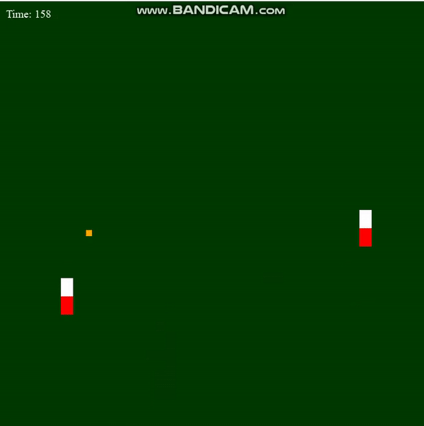

# SelfPlayingPong-WIP-
Attempt to make pong learn by having two paddles controlled by neural networks evolve over time through a reward-based system (Genetic Algorithm). Very rough, feedback/help is welcomed.

Q and W to adjust speed.

